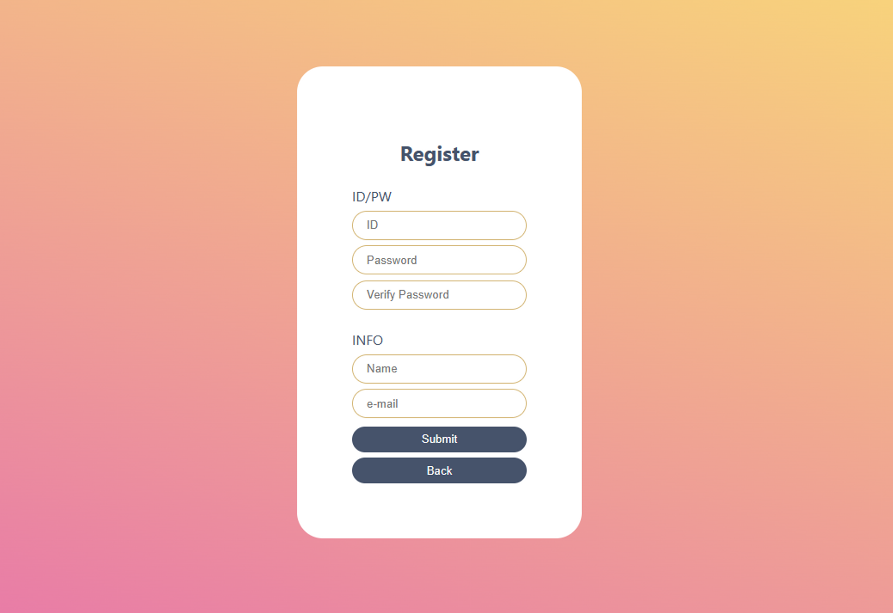
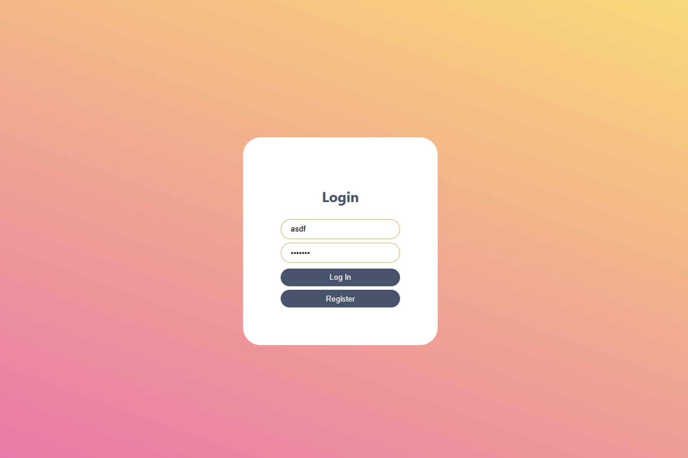

# Team_BC

team_bc

<!-- PROJECT SHIELDS -->
<!--
*** I'm using markdown "reference style" links for readability.
*** Reference links are enclosed in brackets [ ] instead of parentheses ( ).
*** See the bottom of this document for the declaration of the reference variables
*** for contributors-url, forks-url, etc. This is an optional, concise syntax you may use.
*** https://www.markdownguide.org/basic-syntax/#reference-style-links
-->

[![Issues][issues-shield]][issues-url]


<!-- TABLE OF CONTENTS -->
## Table of Contents

* [About the Project](#about-the-project)
  * [Built With](#built-with)
* [Getting Started](#getting-started)
* [Service](#Service)
* [UI](#UI)
* [Database](#Database)


<!-- ABOUT THE PROJECT -->
## About The Project

* Your time should be focused on creating something amazing. A project that solves a problem and helps others
* You shouldn't be doing the same tasks over and over like creating a README from scratch
* You should element DRY principles to the rest of your life :smile:

### Built With
This section should list any major frameworks that you built your project using. Leave any add-ons/plugins for the acknowledgements section. Here are a few examples.

* [PostgreSQL]
* [Flask]
* [React.js]
* [Docker]


<!-- GETTING STARTED -->
## Getting Started

This is an example of how you may give instructions on setting up your project locally.
To get a local copy up and running follow these simple example steps.

### Prerequisites

This is an example of how to list things you need to use the software and how to install them.
* npm
```sh
npm install npm@latest -g
```

### Installation

1. Get a free API Key at [https://example.com](https://example.com)
2. Clone the repo
```sh
git clone https://github.com/your_username_/Project-Name.git
```
3. Install NPM packages
```sh
npm install
```
4. Enter your API in `config.js`
```JS
const API_KEY = 'ENTER YOUR API';
```


<!-- USAGE EXAMPLES -->
## Service

회원가입을 통해 계정을 등록하고, 등록된 계정정보로 로그인하여 게시글 및 댓글을 작성하고 수정/삭제할 수 있는 게시판 서비스입니다. 


<!-- CONTRIBUTING -->
## UI

Login page:



Register page:



<!-- LICENSE -->
## Database

* UserInfo

| id | password | email | name |
| :---: | :---: | :---: | :---: |
| VARCHAR (40) | VARCHAR (40) | VARCHAR (40) | VARCHAR (40) |
| NOT NULL | NOT NULL | NOT NULL | NOT NULL |

* ArticleInfo

| aid | title | uploader | timestamp | article |
| :---: | :---: | :---: | :---: | :---: |
| INT | VARCHAR (80) | VARCHAR(40) | DateTime | VARCHAR(6000) |
| AUTO INCREMENT | NOT NULL |
| NOT NULL |
| PK | 

* CommentInfo

| rid | aid | reply | uploader | timestamp |
| :---: | :---: | :---: | :---: | :---: |
| INT | INT | VARCHAR (600) | VARCHAR(40) | DateTime |
| AUTO INCREMENT | NOT NULL | NOT NULL |
| NOT NULL |
| PK | 


